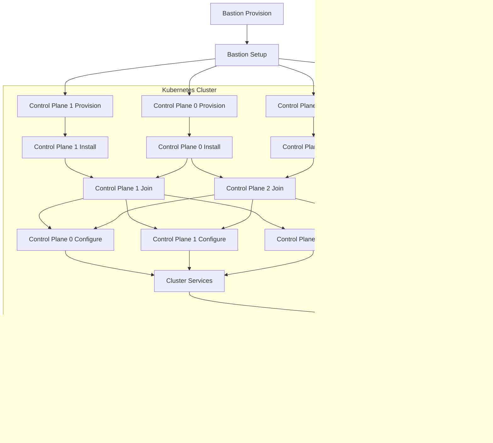

# DAG (Directed Acyclic Graph) of dependencies for Infrastructure (Simultaneous Join)

```mermaid
graph TD;
    b0[Bastion Provision]-->b1[Bastion Setup];

    b1[Bastion Setup]-->e0[Keeper Provision];
    
    b1[Bastion Setup]-->h0[Control Plane 1 Provision];
    b1[Bastion Setup]-->g0[Control Plane 0 Provision];
    b1[Bastion Setup]-->i0[Control Plane 2 Provision];

    g3-->e2
    
    
    
    subgraph HashiCorp Vault
    e0-->e1[Keeper Install];
    e1-->e2[Keeper Configure];
    end

    subgraph Kubernetes Cluster
    g0-->g1[Control Plane 0 Install];
    h0-->h1[Control Plane 1 Install];
    i0-->i1[Control Plane 2 Install];
    h1-->h2[Control Plane 1 Join];
    g1-->h2;
    g1-->i2;
    i1-->i2[Control Plane 2 Join];
    
    h2-->h3[Control Plane 1 Configure];
    h2-->g2[Control Plane 0 Configure];
    h2-->i3[Control Plane 2 Configure];
    
    i2-->h3;
    i2-->g2;
    i2-->i3;
    
    g2-->g3[Cluster Services];
    h3-->g3;
    i3-->g3;
    
    e2-->g4[Cluster Microservices];
    end

    g4-->g5[Infrastructure Complete];
```